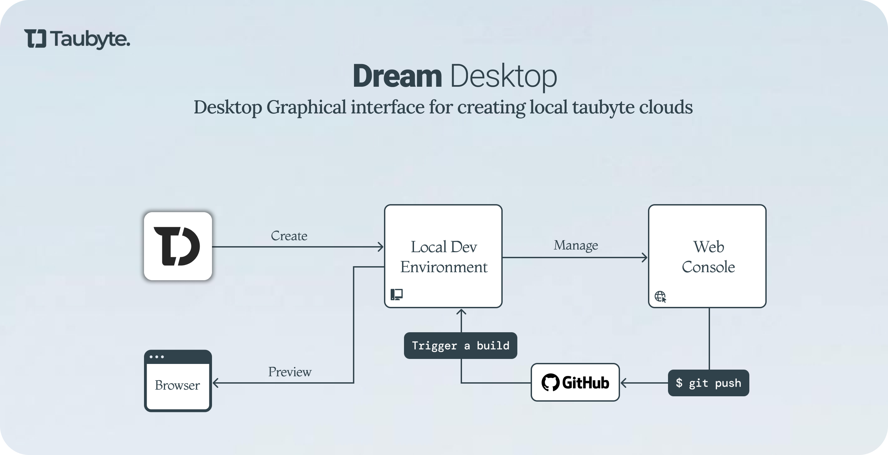

  

 

  
  
  

 

Taubyte is the company behind **Tau**, an open-source, Git-native platform-as-a-service for building, deploying, and scaling applications. Infrastructure is defined in Git, eliminating API calls. Fully self-hosted with capabilities similar to Vercel, Netlify, and Cloudflare, plus built-in AI features.

---

## Our Projects

| Project | Description |
|---------|-------------|
| [tau](https://github.com/taubyte/tau) | Build your own Cloud Computing Platform - single binary, zero dependencies |
| [orbit](https://github.com/taubyte/vm-orbit) | Extend capabilities to AI and more with the plugin system |
| [dreamland](https://github.com/taubyte/dreamland) | Local development environment that mirrors production |
| [spore-drive](https://github.com/taubyte/spore-drive) | Automated deployment tool for Tau infrastructure |
| [libdream](https://github.com/taubyte/tau/tree/main/libdream) | Write E2E unit tests with the Dream framework |

---

## Production Deployment

### Spore Drive

Deploy Tau to your infrastructure with a single command. Provide the Tau binary, a hosts file with server IPs and credentials (passwords or SSH keys), and optional domain provider configuration. Spore Drive handles the rest, creating your personal Taubyte cloud.

  

---

## Developer Workflow

### Dream CLI

Create a local cloud environment, manage it through the web console, push your code, trigger builds, and preview your resources - all from the terminal.

  

 

### Dream Desktop

The same powerful workflow, now with a graphical interface. Build, preview, and deploy without leaving your desktop.

  

---

## Resources

**Documentation** - Learn how to use Taubyte at [taubyte.com/doc](https://taubyte.com/doc)

**Technical Blog** - Read our engineering insights at [taubyte.com/blog](https://taubyte.com/blog/)

**Video Tutorials** - Fast-paced [Hitchhiker's Guide to Taubyte](https://www.youtube.com/playlist?list=PLLKNB3tJrL9Y4nl0JnBhU2wHS4iWldUfh) series

---

## Contributing

Tau thrives with your help. Fix bugs, add features, improve docs, or guide the community.

**How to contribute**
- Fork, branch from `main`, make changes, test, submit a PR
- Keep commits focused and describe **what** and **why** clearly
- New here? Look for `good first issue`

Read our [Code of Conduct](https://github.com/taubyte/tau/blob/main/CODE_OF_CONDUCT.md) and [Contribution Guidelines](https://github.com/taubyte/tau/blob/main/CONTRIBUTING.md)

---

## Connect

Follow, watch, and chat with us:

X: [@dtaubyte](https://x.com/dtaubyte) | Instagram: [@dtaubyte](https://instagram.com/dtaubyte) | YouTube: [Taubyte](https://youtube.com/@taubyte) | Discord: [Join](https://discord.gg/KbN3KN7kpQ)

 

  Built by the Taubyte team

